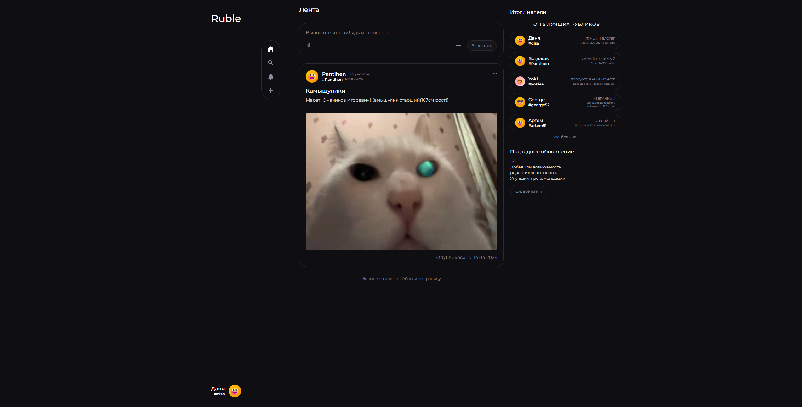

# 🚀 Productivity Social Network

Социальная сеть для людей, которые хотят расти, ставить цели и достигать результатов вместе с единомышленниками.
## ✨ О проекте

**Productivity Social Network** — это платформа, где пользователи могут:
- ставить личные и командные цели
- отслеживать прогресс
- делиться достижениями
- находить мотивацию в сообществе продуктивных людей

Цель проекта — объединить людей, которые стремятся к саморазвитию и эффективной работе.

---

## 🧠 Основные функции(в процессе)

- 🏆 Система достижений и уровней
- 👥 Социальная лента (посты, достижения, отчёты)
- 💬 Комментарии и поддержка пользователей
- 🔔 Уведомления о прогрессе и активности
- 🔍 Поиск пользователей

---

## 🛠 Технологии

- Frontend: JS(в процессе)
- Backend: Django / Django REST Framework
- Database: PostgreSQL
- Auth: JWT 
- UI: CSS
- Deployment: Docker + Nginx(в процессе)

---

## ⚙️ Установка и запуск

```bash
# клонировать репозиторий
git clone https://github.com/mrDisa/Rubl.git

cd Rubl

# установить зависимости backend
pip install -r requirements.txt

# выполнить миграции
python manage.py migrate

# запустить сервер
python manage.py runserver